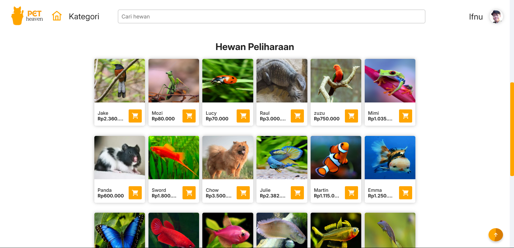
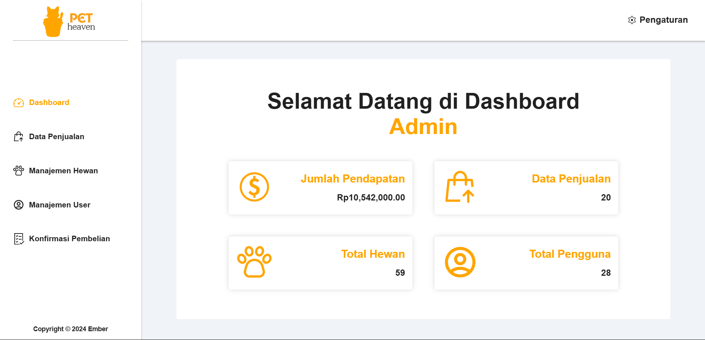
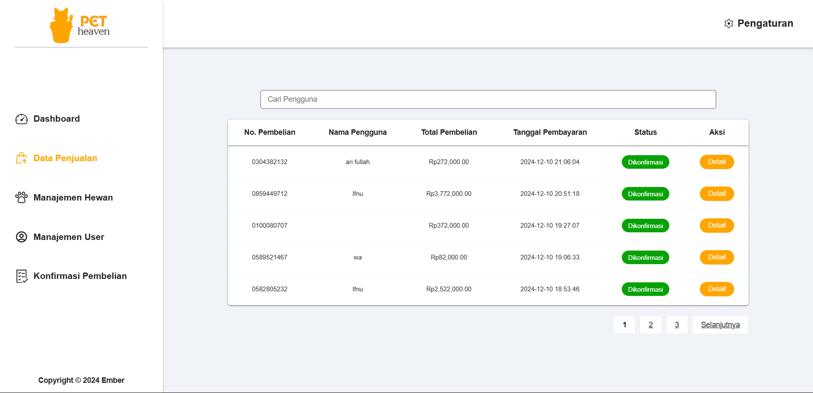
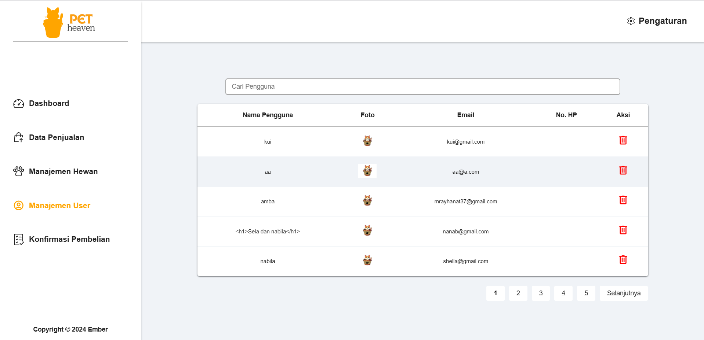
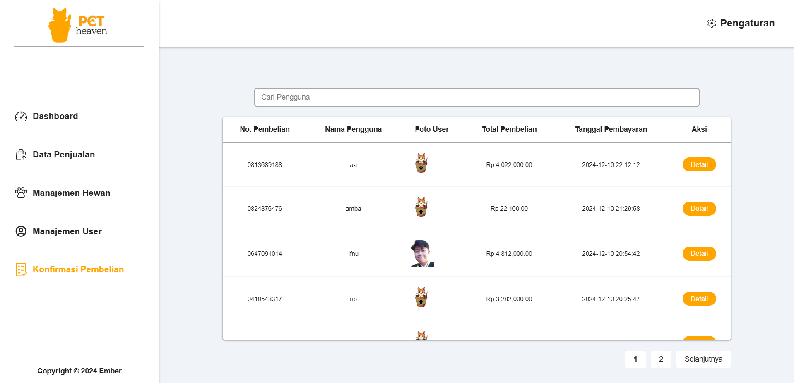

# Pet-Heaven-

Tema Proyek  : Aplikasi Web penjualan hewan
Judul Proyek : Pet-Heaven

## Deskripsi Web
Pet-heaven adalaha sebuah website e-commerce penjualan hewan peliharaan yang memiliki berbagai kategori dan jenis hewan yang beragam.
Aplikasi web ini dibangun menggunakan bahasa:

- HTML
- CSS
- JavaScript
- PHP

Memiliki beberapa fitur antara lain sebagai berikut:

- Login & Registrasi
- Searching
- Kategori
- Profile
- Transaski
- Dashboard Admin

### Tampilan aplikasi web pada sisi pengguna:

#### Home

#### Produk / Hewan

### Tampilan dashboard admin:

#### Dashboard Admin

#### Data hasil penjualan

#### Manajemen Hewan

#### Manajemen User

#### Konfirmasi Pembelian

### Cara mengakses aplikasi web:

Cara masuk ke website :

- Buka browser (Chrome)
- Ketik url : https://pet-heaven.wuaze.com

